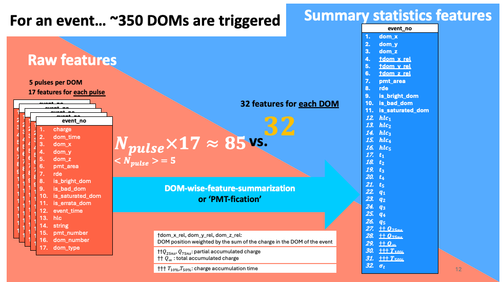
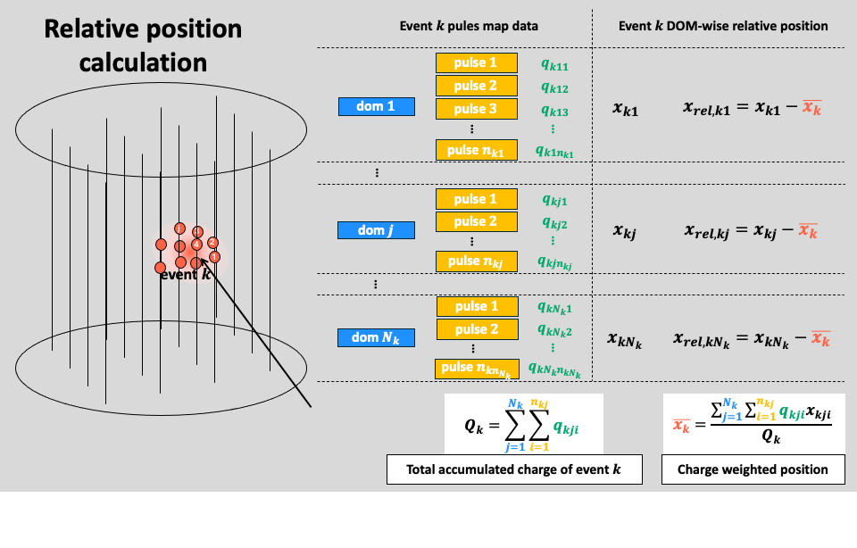
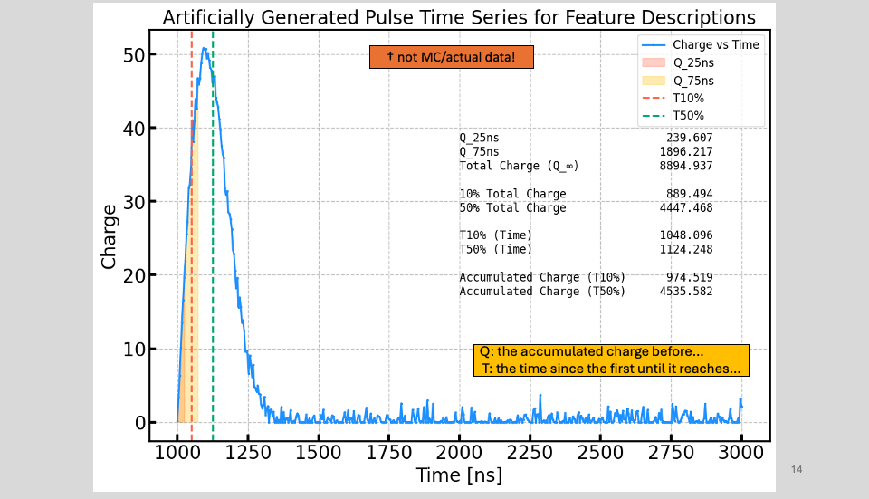
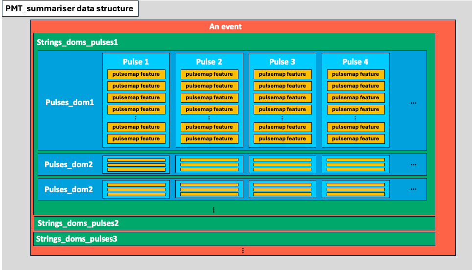

  
# DOM-wise Summarisation for IceCube Monte Carlo Data
> python files a user runs: [PMTfy_by_part.py(recommended)](https://github.com/KUcyans/PMTfication/blob/main/PMTfy_by_part.py) of `PMTfy_by_subdir.py`.
This is an algorithm to shrink pulse map data from IceCube Neutrino Observatory in an elegant way. It reduces the pulsemap series to one row per DOM position in a single event while keeping essential information such as charge and time profiles.

## Assumptions and the Data Storage Structure:
> The algoritm requires very specific data storage format. The data storage structure is assumed to be as follows:
1. By Jan. 2025, only summarisation **from sqlite .db to .parquet** format is supported
2. Source Data(.db):
   * Data are stored across several directories.
   * Each directory(e.g.22012) has several multiple .db files each has a conceptual name of 'part' in this project.
3. Target Data(.parquet)
   * The structure in which the target data are stored is similar to the source data.
   * There will be the directory having the same name as the source directory(e.g.22012)
   * In each directory, there will be several subdirectories in each directory. The subdirectories correspond to the 'parts'(the .db files in the source directory)
   * In each directory, there will also be truth parquet files and they also correspond to the 'parts'
   * In each subdirectory, there will be DOM-wise summarised files. Each of them are called 'shard' in the code.
   * Missing data in the source data will be filled with the default value of the data type. 
4. Neither the source data nor the summarised data are selected based on the feature.
5. 

## Logical structure of the code
  * Core summarisation functions are in [PMT_summariser](https://github.com/KUcyans/PMTfication/blob/main/PMT_summariser.py): it is the class that governs the calculation of the data
    * uses PMT_ref_pos_adder
  * [PMT_ref_pos_adder](https://github.com/KUcyans/PMTfication/blob/main/PMT_ref_pos_adder.py) adds `string` and `dom_number` columns to the data if they are missing.
    * `string` and `dom_number` columns are needed to identify distinctive DOM locations based on `dom_x`, `dom_y`, and `dom_z` with respect to the [sample(reference) DOM positional data](https://github.com/KUcyans/PMTfication/blob/main/dom_ref_pos/unique_string_dom_completed.csv)
  * [PMT_truth_maker](https://github.com/KUcyans/PMTfication/blob/main/PMT_truth_maker.py) generates the truth parquet files for a part
  * [PMTfier](https://github.com/KUcyans/PMTfication/blob/main/PMTfier.py) wraps the core logic files.
    * Consists of three hierarchical layers: shard, part, subdir. 
    * PMT_summariser is in the lowest level, shard
    * PMT_truth_maker is on one more level above, part: (this is why truth files are stored part-wisely)
    * it generates a new event_no based on the location of the data so that every even_no is distinctive from one another. See `_add_enhance_event_no` function.

## Summarising Features
### Relative Position Calculation: implying the how much charge was accumulated in an individual DOMs in an event
> dom_rel: relative position of the DOM with respect to charge weighted average position of the DOM in the event
#### $x_{rel,jk} = x_{jk}-\bar{x_{k}}$

* $i$: pulse index
* $j$: dom index
* $k$: event number

For a single DOM($j$), a given event($k$), the charge-weighted average position $\bar{x_{jk}}$ is calculated as follows:

1. First, the total charge accumulated in the DOM($j$) in the event($k$) is calculated as follows:

$$
Q_{jk} = \sum_{i=1}^{n_{jk}} q_{ijk}
$$

$i$ denotes individual pulses, $n_{jk}$ is the total number of pulses in the DOM($j$) in the event($k$).  

2. Secondly, the total charge accumulated in all the DOMs involved in the event($k$) is calculated as follows:

$$
Q_{k} = \sum_{j=1}^{N_k} Q_{jk}
$$  

$N_k$ is the total number of DOMs involved in the event($k$).s

3. Next — come back to the DOM($j$) in the event($k$) level to calculate the charge-weighted average of the position

$$
\bar{x_{k}} = \frac{\sum_{j=1}^{N_k} \sum_{i=1}^{n_{jk}} x_{ijk} \, q_{ijk}}{Q_{k}}
$$

again, $i$ denotes individual pulses, $n_{jk}$ is the total number of pulses in the DOM($j$) in the event($k$).

4. Finally, the relative position for DOM($j$), event($k$): 

$$ 
x_{rel, jk} = x_{jk} - \bar{x_{k}}
$$

5. To summarise, the relative position of the DOM($j$) in the event($k$) is calculated by subtracting the charge-weighted average position of the DOM in the event from the absolute position of the DOM in the event.

$$
\boxed{x_{rel, jk} = x_{jk} - \frac{\sum_{j=1}^{N_k} \sum_{i=1}^{n_{jk}} x_{ijk} \, q_{ijk}}{Q_{k}}}
$$

### Q and T: implying the overall profile of the charge-time distribution
* $Q_{25}, Q_{75}$ are the accumulated charge in the time window starting from the first pulse time and ending at 25ns and 75ns respectively.
* $T_{10}, T_{50},$ are the time at which the accumulated charge reaches 10%, and 50% of the total charge respectively.

## Execution
  * Can be submitted to slurm if available. [See this shell script](https://github.com/KUcyans/PMTfication/blob/main/PMTfy_by_part.sh)
  * Arguments for [PMTfy_by_part.py](https://github.com/KUcyans/PMTfication/blob/main/PMTfy_by_part.py) are these
    * `Snowstorm_or_Corsika`: can either be Snowstorm or Corsika
    * `subdirectory_in_number`: 22010, 22011, 22012, ... this is the name of the directory where the source data are stored.
    * `part_number`: the number of the file in the directory that will be processed
    * `N_events_per_shard`: the amount of the events in one DOM-wisely summarised file has to be specified.
      * The size of the source data for an event will vary depending on the overall energy range of the data.
      * In general, higher energy data will contain more number of DOMs and more number of pulses at each DOM.
    * the name of the source table from which the data will be loaded is set to be 'SRTInIcePulses'

## Issues
1. For data having too many events in one file, [PMTfy_by_part.py](https://github.com/KUcyans/PMTfication/blob/main/PMTfy_by_part.py) may fail to process the data.

## Tasks
> * DO NOT use pandas for final implementation.
> * Keeping track of the hierarchical structure of event-DOM-pulse in [PMT_summariser](https://github.com/KUcyans/PMTfication/blob/main/PMT_summariser.py) is often frustratingly painful for me. Be patient unless you have an ingenious idea to improve.
1. [PMT_truth_maker](https://github.com/KUcyans/PMTfication/blob/main/PMT_truth_maker.py)
   1. cannot handle data files whose truth table do not have exactly the same column names as specified in the schemas.
     * schemas are meant to make truth-making more efficient but it is not suitable to cope with different source data.
     * So one might have to consider avoid using schemas or implement more flexible schema building logic
2. [PMT_ref_pos_adder](https://github.com/KUcyans/PMTfication/blob/main/PMT_ref_pos_adder.py)
   1. currently uses .csv file but it could be replaced with a GeoCalib file. (Leave the csv file as default option)  
3. [PMT_summariser](https://github.com/KUcyans/PMTfication/blob/main/PMT_summariser.py)

   1. [Feasibility check needed before instigation]change the list structure to np.array if possible.
   2. Possible parallelisation or threading of the for loops
4. [PMTfier](https://github.com/KUcyans/PMTfication/blob/main/PMTfier.py)
   1. The current implementation is highly specific to the data stored structure that KU HEP has. There should be more general
   2. Replacing the functions with classes might facilitate the maintenance
5. Filtering for Angular Reconstruction Tasks
   1. Impose three filters to improve the quality of muon-like cases
      1. ~~SRT filter: already imposed~~
      2. abandon events where 'MuonFilter_13' is false
      3. include only events that are not from Cosmic Ray: selected events will be generated by Janni
         * the selection receipt will contain `Run ID, Subrun ID, Event ID`, (+ perhaps `SubeventID`) and need to figure out how to use them to filter the data.
    2. Eventually there should be a separate data directory for the filtered data apart from the original data and the first-hand PMT-fied data.
    3. two ways of attacking this
       1. add the filtering logic to the existing PMTfication code(use truth table)
          * structure-wisely, it is more intuitive to add the filtering logic to the PMTfication code
          * the implementation can be tricky, and may make the testing and debugging less efficient
          * and wouldn't it be natural to contain everything in one single logic as 'PMTfication'?
          * make PMTfication more complex and less modular
          * (more practical reason) the current version (29.01.2025) PMTfication is stable. Adding the filtering logic to the existing code may cause unexpected issues.
       2. create a separate logic that applies the filtering logic to the PMT-fied data and truth files
          * This will cause issue on the offset column of the truth file as some events will be abandoned.
          * the implementation can be more freely done and the testing and debugging can be more efficient.
          *  the data processing logic will be more modular and the filtering logic can be more easily replaced or modified.